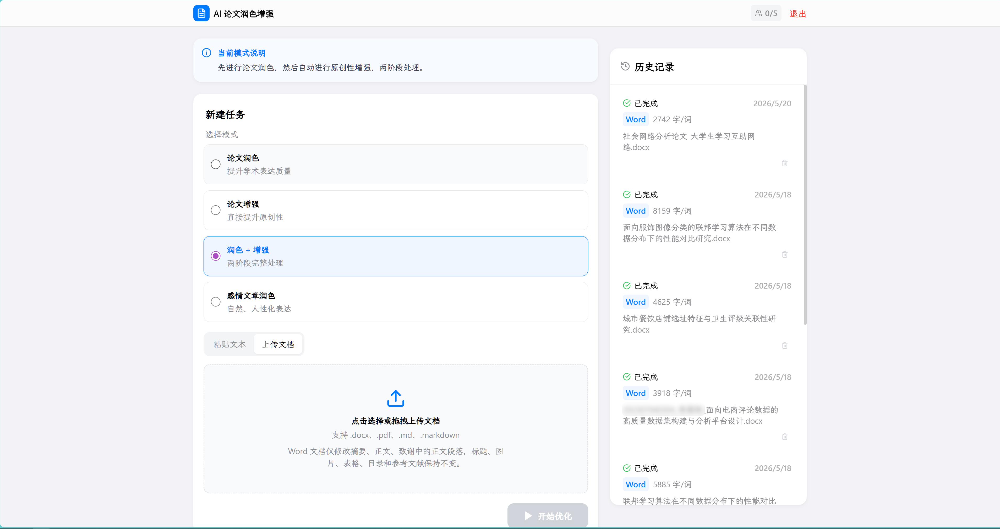
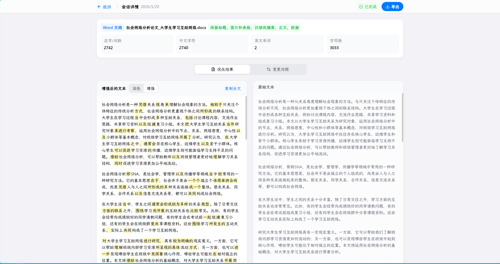
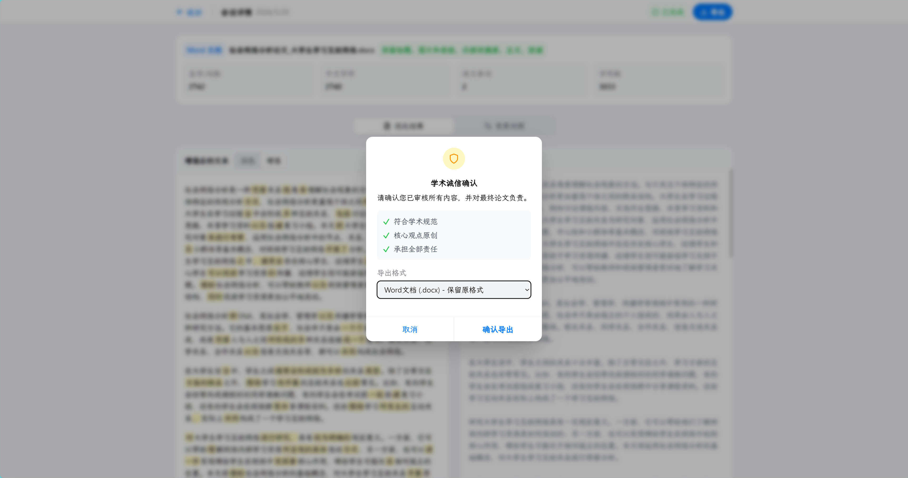
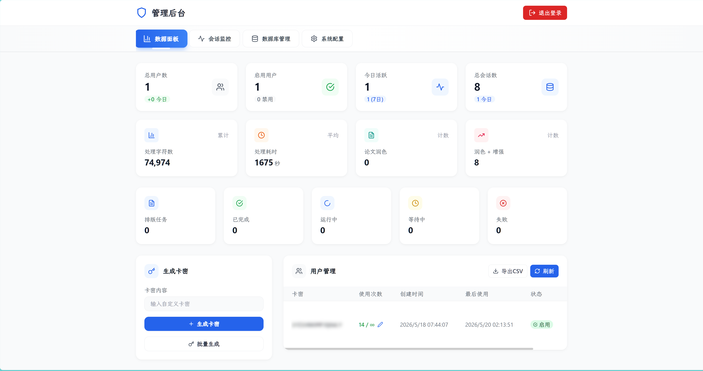
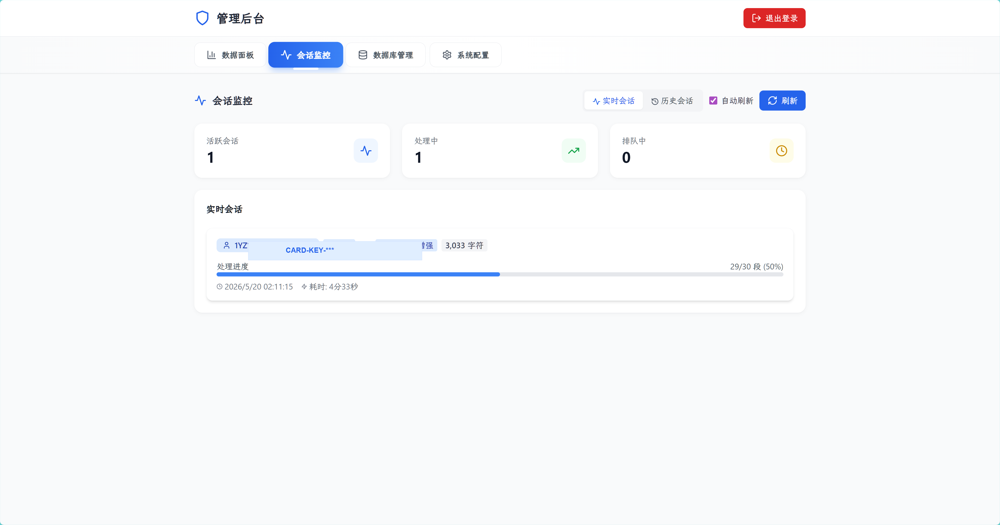
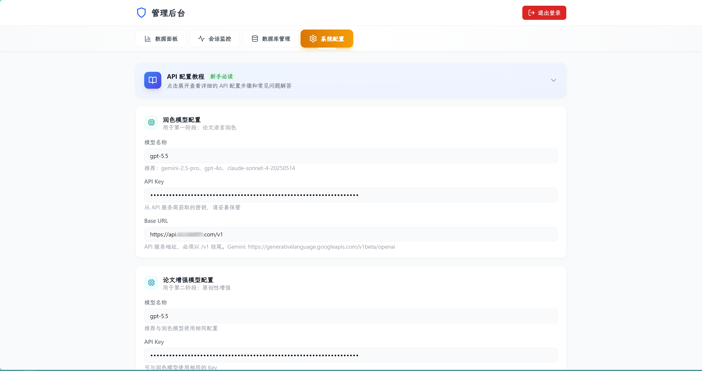

# AI 学术写作助手

[](https://github.com/FigureQAQ/BypassAIGC/releases/latest)
[](https://github.com/FigureQAQ/BypassAIGC/actions/workflows/build-exe.yml)

当前版本：**v2.8.2** · [查看 Release](https://github.com/FigureQAQ/BypassAIGC/releases/tag/v2.8.2) · [查看完整更新日志](CHANGELOG.md)

## v2.8.2 速度优化

- 请求间隔从“每次完成后固定等待”改成“控制请求开始时间”，模型响应超过 1 秒时不再额外等待。
- 默认请求间隔由 6 秒降至 1 秒，双阶段长文档可减少约 19 分钟固定等待。
- 默认关闭高强度思考模式，避免普通润色任务消耗额外推理时间。
- 遇到 429、超时、连接失败和 5xx 错误时自动指数退避重试。

## v2.8.1 修复亮点

- 修复 DeepSeek 等 OpenAI 兼容接口只配置全局 Key/Base URL 时，模型健康检查错误提示“未配置”的问题。
- 自动识别示例占位 Key，处理前给出明确配置提示。
- 失败任务卡片直接显示 API Key、Base URL、限流、超时等可操作原因。
- 已验证失败的 Word 任务在修正配置后可从断点继续处理。

## v2.8.0 更新亮点

本版本将源码运行流程简化为“配置一次 API，之后双击启动”：

- **唯一配置文件**：源码模式统一读取仓库根目录 `.env`，不再复制到 `package/`、`package/backend/` 或桌面目录。
- **一键 API 配置**：双击 `setup.bat`，填写 API Key、Base URL 和模型名称即可生成完整安全配置。
- **一键启动**：双击 `start.bat`，自动创建 `.venv`、按依赖哈希决定是否安装依赖、启动前后端并打开浏览器。
- **一键停止**：双击 `stop.bat`，通过 PID 和端口双重清理前后端进程。
- **启动即进入工作台**：首次启动自动创建随机本地访问用户，浏览器打开后无需再进后台创建卡密。
- **启动健康检查**：只有后端 `/health` 和前端页面都可访问时才提示启动成功。
- **兼容旧入口**：`package/start-app.bat` 仍可使用，但会自动转发到根目录的新启动流程。
- **更清晰的目录**：普通用户只需要关注根目录的 `.env`、`setup.bat`、`start.bat` 和 `stop.bat`。

## v2.7.0 更新亮点

本版本集中优化运行性能、任务稳定性与前端使用体验：

- **更快的首屏加载**：React 页面改为按路由懒加载，工作台、管理后台和文档工具不再全部打入首屏脚本。
- **更稳定的后台任务**：Word 编译移至工作线程，避免阻塞 FastAPI 事件循环；增加任务取消、关闭清理和定时回收。
- **更安全的流式连接**：SSE 使用有界消息队列，慢连接只保留最新消息，避免长时间运行导致内存持续增长。
- **更智能的资源使用**：页面位于后台时自动降低任务和队列轮询频率，重新切回页面后立即同步进度。
- **新增工作台功能**：支持直接停止任务、搜索历史记录、按状态筛选、查看任务统计和快速进入四个文档工具。
- **全新界面设计**：重做登录页与工作台，增加响应式产品介绍、快捷工具卡片、渐变视觉和玻璃质感组件。
- **依赖安全更新**：更新前端锁定依赖，生产依赖安全审计为 0 个已知漏洞。
- **新增回归测试**：覆盖任务取消、事件循环响应、SSE 背压、并发等待清理和后台回收。

## 当前文档处理能力

- 支持粘贴文本，也支持上传 Word（.docx）、PDF（.pdf）和 Markdown（.md/.markdown）文档。
- Word 文档仅润色摘要、正文、致谢中的普通正文段落；目录、标题、图片、表格、参考文献、附录、图表题注、关键词、公式、代码和复杂符号语句会保持不变。
- Markdown 文档会按论文结构识别摘要、正文、致谢，只润色普通文本段落；标题、目录、参考文献、附录、代码块、表格、公式、链接、图片、行内代码和复杂符号语句会保持不变。
- Markdown 导出会优先回填到原始 `.md/.markdown` 文件结构中，保留标题层级、代码块、表格、公式和其他 Markdown 语法。
- PDF 支持文本提取和 PDF 导出；扫描件或图片型 PDF 如果无法提取文本，会提示无法处理。
- 优化结果可导出为 TXT、Markdown、Word 和 PDF。

## PowerShell 中文支持

- Windows 启动脚本会自动切换到 UTF-8 控制台代码页（65001），并设置 PowerShell、Python、npm 子进程的 UTF-8 输入输出。
- `package/start-app.ps1` 和 `package/build.ps1` 已保存为 UTF-8 with BOM，兼容 Windows PowerShell 5.1，避免脚本里的中文提示显示为乱码。
- Windows 用户直接双击仓库根目录的 `start.bat`；旧的 `package/start-app.bat` 会自动转发到新入口。

专业论文润色与语言优化系统，适合本地部署、论文草稿预处理、文档格式保留导出和多阶段语言优化。

## 功能预览

以下截图来自本仓库当前版本的实际运行界面，展示的是本项目二次增强后的文档处理、润色预览、Word 保格式导出和管理后台能力。

### 用户主界面



### 润色增强与高亮预览



### Word 文档保留原格式导出



### 管理后台数据面板



### 管理后台会话监控



### 管理后台 API 配置



## 来源与功能差异

本仓库基于原作者 Yan Wenxin 的 BypassAIGC 项目整理和二次增强，遵循原项目的 CC BY-NC-SA 4.0 许可协议。原作者版权与许可声明保留在 [LICENSE](LICENSE) 中。

本仓库不是原作者官方发布版本，主要面向本地部署、论文文档处理和 GitHub Release 分发做了以下调整：

- **文档提交能力**：在粘贴文本之外，增加/强化 Word（.docx）、PDF（.pdf）和 Markdown（.md/.markdown）上传入口。
- **论文范围识别**：Word 与 Markdown 会优先识别摘要、正文、致谢，只润色普通正文段落，尽量避免改动目录、标题、参考文献、附录、图表题注、关键词等结构性内容。
- **技术内容保护**：公式、代码、表格、图片、链接、行内代码和复杂符号/字母语句会被保护，降低论文里的技术内容被误改的概率。
- **保格式导出**：Word 导出会基于原始 `.docx` 替换可润色段落；Markdown 导出会回填到原始 Markdown 结构；同时保留 TXT、Word、Markdown、PDF 多格式导出。
- **长时间使用稳定性**：优化了前端按钮重复点击、SSE 清理、轮询请求和后台任务数据库会话，减少长时间使用后按钮卡住或任务状态不同步的问题。
- **并发与提示词**：增加单个卡密最大并发数配置，并让用户设置的默认自定义提示词实际参与润色/增强流程。
- **发布与 Windows 体验**：补充 GitHub Actions 三平台打包、Release 产物命名、PowerShell 中文/UTF-8 支持和发布用 README/.env 示例。

## 快速开始

### Windows 三步启动（本地源码版）

下载源码后，只需要操作仓库根目录：

1. 双击 `setup.bat`，依次填写 API Key、Base URL 和模型名称。
2. 双击 `start.bat`。
3. 浏览器会自动打开。

首次启动会自动创建 Python 虚拟环境并安装前后端依赖；以后只有依赖文件变化时才会重新安装。

如果已经熟悉 `.env`，也可以跳过 `setup.bat`：

```bash
copy .env.example .env
```

然后只修改 `.env` 顶部的 4 项：

```env
OPENAI_API_KEY=你的API密钥
OPENAI_BASE_URL=https://api.openai.com/v1
POLISH_MODEL=你的模型名称
ENHANCE_MODEL=你的模型名称
```

根目录启动脚本会自动：

1. 读取唯一的根目录 `.env`
2. 创建或复用根目录 `.venv`
3. 按需安装 Python 和 npm 依赖
4. 清理旧的 9800 / 5174 端口进程
5. 启动前后端并打开浏览器

`setup.bat` 会自动生成随机的本地访问密钥，并让浏览器通过专属访问链接直接进入工作台。默认服务只监听 `127.0.0.1`，不会开放给局域网。

常用地址：

```text
用户界面: http://localhost:5174
管理后台: http://localhost:5174/admin
API 文档: http://localhost:9800/docs
```

停止应用时双击根目录 `stop.bat`。

### 发布版快速开始

无需安装任何开发环境，下载即可使用！

1. 从 [Releases](https://github.com/FigureQAQ/BypassAIGC/releases) 页面下载对应平台的可执行文件：
   - Windows: `BypassAIGC-Windows-vX.X.X.zip`
   - macOS: `BypassAIGC-macOS-vX.X.X.tar.gz`
   - Linux: `BypassAIGC-Linux-vX.X.X.tar.gz`

2. 解压到任意目录

3. 首次运行会自动创建 `.env` 配置文件模板，至少填入：
   - `OPENAI_API_KEY`
   - `OPENAI_BASE_URL`
   - `POLISH_MODEL`
   - `ENHANCE_MODEL`

4. 再次运行程序，将自动打开浏览器

5. 访问管理后台创建卡密

> 💡 提示：数据库文件 `ai_polish.db` 和配置文件 `.env` 都保存在可执行文件同目录，方便备份和迁移。

### 文档处理说明

- 上传 Word（.docx）后，系统会统计字数，并只抽取可修改范围进入优化流程。
- Word 可修改范围：摘要、正文、致谢中的正文段落。
- Word 正文识别支持常见论文结构：`第 X 章`、`1 导论`、`1.1 小节`、`一、标题`、`（一）标题` 等章节标题后的正文。
- Word 正文识别也支持编号列表和说明类正文，例如 `第 1 部分：...`、`（1）...`、`1. 域适应：...`、`理论分析：...`、`仿真实验：...`。
- Word 会避免把带句号、冒号、分号等正文句式的段落误判为标题，从而减少正文漏读。
- Word 保留范围：真正的短标题、图片、表格、目录、参考文献、附录、图表题注、关键词等不会被修改。
- Word 导出会基于原始 `.docx` 文件进行文本替换，尽量保持提交文档的原始样式、图片、分页结构和对象不变。
- PDF 支持文本提取和 PDF 导出；扫描件或图片型 PDF 如果无法提取文本，会提示无法处理。
- Markdown 支持上传和导出，适合保留轻量文本结构。
- 详情页会对修改后的文字做高亮显示，便于逐段核对。

### 配置文件说明

`.env` 配置文件包含以下重要配置项：

```properties
# 数据库配置
DATABASE_URL=sqlite:///./ai_polish.db
# 或使用 PostgreSQL: postgresql://user:password@IP/ai_polish

# Redis 配置 (用于并发控制和队列)
REDIS_URL=redis://IP:6379/0

# OpenAI API 配置
OPENAI_API_KEY=KEY
OPENAI_BASE_URL=http://IP:PORT/v1

# 第一阶段模型配置 (论文润色) - 推荐使用 gemini-2.5-pro
POLISH_MODEL=gemini-2.5-pro
POLISH_API_KEY=KEY
POLISH_BASE_URL=http://IP:PORT/v1

# 第二阶段模型配置 (原创性增强) - 推荐使用 gemini-2.5-pro
ENHANCE_MODEL=gemini-2.5-pro
ENHANCE_API_KEY=KEY
ENHANCE_BASE_URL=http://IP:PORT/v1

# 感情文章润色模型配置 - 推荐使用 gemini-2.5-pro
EMOTION_MODEL=gemini-2.5-pro
EMOTION_API_KEY=KEY
EMOTION_BASE_URL=http://IP:PORT/v1

# 并发配置
MAX_CONCURRENT_USERS=7
MAX_CONCURRENT_PER_USER=3

# 会话压缩配置
HISTORY_COMPRESSION_THRESHOLD=2000
COMPRESSION_MODEL=gemini-2.5-pro
COMPRESSION_API_KEY=KEY
COMPRESSION_BASE_URL=http://IP:PORT/v1

# 流式输出配置（推荐保持默认值）
USE_STREAMING=false  # 默认禁用，避免某些API（如Gemini）返回阻止错误
STREAM_QUEUE_MAX_SIZE=256  # 单个浏览器 SSE 连接的最大缓存消息数

# 快速请求调度
API_REQUEST_INTERVAL=1
API_MAX_RETRIES=3
API_RETRY_BASE_DELAY=2
API_RETRY_MAX_DELAY=20
THINKING_MODE_ENABLED=false
THINKING_MODE_EFFORT=low

# 文件上传限制（MB），0 表示无限制
MAX_UPLOAD_FILE_SIZE_MB=0

# PDF 导出字体配置（可选；Windows 会自动尝试微软雅黑/宋体）
PDF_FONT_PATH=
PDF_FONT_NAME=DocumentChineseFont

# JWT 密钥
SECRET_KEY=JWT-key
ALGORITHM=HS256
ACCESS_TOKEN_EXPIRE_MINUTES=60

# 管理员账户
ADMIN_USERNAME=admin
ADMIN_PASSWORD=admin123
DEFAULT_USAGE_LIMIT=1
SEGMENT_SKIP_THRESHOLD=15
```

**注意:** 
- 推荐使用 Google Gemini 2.5 Pro 模型以获得更好的性能和成本效益
- BASE_URL 使用 OpenAI 兼容格式，需要配置支持 OpenAI API 格式的代理服务
- **流式输出默认禁用**：为避免某些 API（如 Gemini）返回阻止错误，系统默认使用非流式模式。可在管理后台的"系统配置"中切换

### 访问地址

- 用户界面: http://localhost:8000
- 管理后台: http://localhost:8000/admin
- API 文档: http://localhost:8000/docs

## 功能特性

- **双阶段优化**: 论文润色 + 学术增强
- **智能分段**: 自动识别标题，跳过短段落
- **文档提交**: 支持粘贴文本，也支持上传 Word（.docx）、PDF（.pdf）和 Markdown（.md/.markdown）文档
- **多格式导出**: 优化结果可导出为 TXT、Markdown、Word 和 PDF
- **Word 保格式输出**: Word 文档导出时保留原文档结构，仅替换被优化的正文段落文字
- **Word 范围控制**: Word 文档仅修改摘要、正文、致谢中的正文段落，标题、图片、表格、目录、参考文献、附录、图表题注和关键词保持不变
- **字数统计**: Word/文档会话展示总字/词数、中文字符数、英文单词数和字符数
- **修改高亮预览**: 会话详情页高亮显示修改后的文字，方便核对变更
- **使用限制**: 卡密系统，可配置使用次数
- **并发控制**: 队列管理，动态调整并发数
- **实时配置**: 修改配置无需重启服务
- **数据管理**: 可视化数据库管理界面

## 管理后台

访问 `http://localhost:8000/admin` 使用管理员账户登录

### 功能模块
- 📊 **数据面板**: 用户统计、会话分析
- 👥 **用户管理**: 卡密生成、使用次数控制
- 📡 **会话监控**: 实时会话状态监控
- 💾 **数据库管理**: 查看、编辑、删除数据记录
- ⚙️ **系统配置**: 模型配置、并发设置、使用限制

## 核心配置说明

| 配置项 | 说明 | 默认值 |
|--------|------|--------|
| `MAX_CONCURRENT_USERS` | 最大并发用户数 | 5 |
| `MAX_CONCURRENT_PER_USER` | 单个卡密可同时运行的最大任务数 | 3 |
| `DEFAULT_USAGE_LIMIT` | 新用户默认使用次数 | 1 |
| `SEGMENT_SKIP_THRESHOLD` | 段落跳过阈值（字符数） | 15 |
| `HISTORY_COMPRESSION_THRESHOLD` | 历史压缩阈值 | 5000 |
| `API_REQUEST_INTERVAL` | 相邻请求开始时间的最小间隔（秒） | 1 |
| `API_MAX_RETRIES` | 429、超时和临时服务错误的最大重试次数 | 3 |
| `API_RETRY_BASE_DELAY` | 首次重试等待秒数，后续指数增长 | 2 |
| `API_RETRY_MAX_DELAY` | 单次重试最大等待秒数 | 20 |
| `THINKING_MODE_ENABLED` | 是否启用模型推理模式 | false |
| `THINKING_MODE_EFFORT` | 推理强度 | low |
| `USE_STREAMING` | 启用流式输出模式 | false（推荐）|
| `STREAM_QUEUE_MAX_SIZE` | 单个 SSE 连接最大缓存消息数 | 256 |
| `MAX_UPLOAD_FILE_SIZE_MB` | 文档上传大小限制，0 表示无限制 | 0 |
| `PDF_FONT_PATH` | PDF 导出中文字体路径，可留空自动检测 Windows 字体 | 空 |
| `PDF_FONT_NAME` | PDF 导出字体注册名称 | DocumentChineseFont |

## 项目结构

```text
BypassAIGC/
├── setup.bat            # 首次配置 API
├── start.bat            # 一键启动
├── stop.bat             # 一键停止
├── .env                 # 唯一运行配置（自行创建，不提交）
├── .env.example         # 配置模板
├── package/             # 内部程序源码与构建文件
│   ├── backend/         # FastAPI 后端
│   └── frontend/        # React 前端
├── docs/                # 截图和发布说明
└── README.md
```


**⚠️ 重要提示**: 生产环境部署前，请务必:
1. 修改 `.env` 中的默认管理员密码
2. 生成强 SECRET_KEY (至少 32 字节随机字符串)
3. 填写有效的 OPENAI_API_KEY

## 常见问题

**Q: 端口被占用？**  
A: 双击 `stop.bat`，它会清理默认的 9800 和 5174 端口。

**Q: 配置修改后未生效？**  
A: 重启程序使配置生效

**Q: 登录失败？**  
A: 检查 `.env` 中的 `ADMIN_USERNAME` 和 `ADMIN_PASSWORD`

**Q: AI 调用失败？**  
A: 检查 API Key 和 Base URL 配置是否正确

**Q: Gemini API 返回 "Your request was blocked" 错误？**  
A: 这是因为 Gemini API 可能阻止流式请求。解决方法：
1. 登录管理后台 (`http://localhost:8000/admin`)
2. 进入"系统配置"标签页
3. 找到"流式输出模式"开关，确保它是**禁用**状态（推荐）
4. 点击"保存配置"按钮
5. 重新运行优化任务

默认配置已经禁用了流式输出，如果仍然遇到此问题，请检查 `.env` 文件中的 `USE_STREAMING` 设置是否为 `false`

## 自行构建可执行文件

如果需要自行构建可执行文件，请参考 [package/README.md](package/README.md)。

### 本地构建

```bash
# Linux/macOS
cd package
chmod +x build.sh
./build.sh

# Windows
cd package
.\build.ps1
```

### GitHub Actions 自动构建

推送以 `v` 开头的标签会自动触发构建：
```bash
git tag v2.8.0
git push origin v2.8.0
```

构建完成后，可在 Releases 页面下载各平台的可执行文件。

## License
未经允许禁止商业使用

Creative Commons (CC BY-NC-SA 4.0)

[](https://star-history.com/#uhwr/BypassAIGC)


